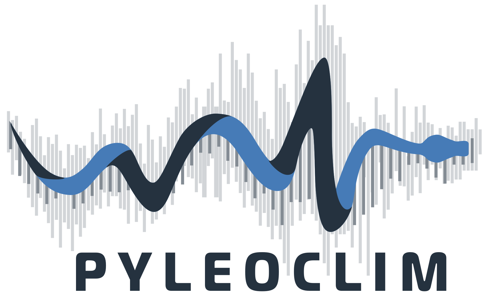

<!----->

# Pyleoclim

**Python Package for the Analysis of Paleoclimate Data**

Paleoclimate data, whether from observations or model simulations, offer unique challenges to the analyst.
Pyleoclim is a Python package primarily geared towards the analysis and visualization of paleoclimate data. Such data usually come in the form of timeseries with missing values and age uncertainties, so the package includes several low-level methods to deal with these issues to simplify the user's life, with intuitive, high-level analysis and plotting methods that support publication-quality scientific workflows.

There are many entry points to Pyleoclim, thanks to its underlying [data structures](https://pyleoclim-util.readthedocs.io/en/stable/core/ui.html). The package makes use of the Linked Paleo Data ([LiPD](http://www.clim-past.net/12/1093/2016/)) standard container and its associated [utilities](http://nickmckay.github.io/LiPD-utilities/). The package is aware of age ensembles stored via LiPD and uses them for time-uncertain analyses, very much like [GeoChronR](https://doi.org/10.5194/gchron-2020-25).

LiPD, however, is not an obligatory entry point to Pyleoclim. Low-level modules are primarily based on [NumPy](http://www.numpy.org) arrays or [Pandas](https://pandas.pydata.org) dataframes, so Pyleoclim contains a lot of timeseries analysis code (e.g. spectral analysis, singular spectrum analysis, wavelet analysis, correlation analysis) that can apply to these more common types as well, including those generated by numerical models (via [xarray](http://xarray.pydata.org)). This makes the package suitable for rigorous model-data comparisons, like [this one](https://www.pnas.org/content/116/18/8728.short).

We've worked very hard to make Pyleoclim accessible to a wide variety of users, from establisher researchers to high-school students, and from seasoned Pythonistas to first-time programmers. A growing collection of workflows that use Pyleoclim are available as Jupyter notebooks in the `example_notebooks` folder and on [LiPDBooks](https://github.com/LinkedEarth/LiPDbooks/tree/master/notebooks).

New in version 0.5.2
--------------------
- re-introduced support for LiPD objects, including loading, export, and mapping
- rigorous time representation, based on [PaCTS](https://doi.org/10.1029/2019PA003632) proposal
- Gaussian kernel method for coarsening time grids
- `common_time` method to put various timeseries on a common timescale, using interpolation, binning or Gaussian kernel
- _MultipleSeries_ methods, including stack plots, correlation, and PCA
- _EnsembleSeries_ methods, including correlation and plotting
- expanded documentation of data structures (classes)
- various bug fixes

New in version 0.5.1
--------------------
- enabled unit tests through TravisCI (to facilitate external contributions)
- developed unit tests for all methods
- expanded documentation, now on [readthedocs](https://pyleoclim-util.readthedocs.io/)
- expanded Jupyter notebook tutorials (under "example_notebooks")
- more user-friendly Getting Started section

New in version 0.5.0
--------------------
- complete redesign of the code, now centered on `Series` objects and descendants.
- [user interface](https://github.com/LinkedEarth/Pyleoclim_util/blob/master/example_notebooks/pyleoclim_ui_tutorial.ipynb) allowing succinct, expressive calls
- expanded repertoire of spectral and wavelet methods
- inclusion of singular spectral analysis, permitting missing data
- Sphinx [documentation](http://linkedearth.github.io/Pyleoclim_util/) for all functions
- clean, additive [plot styles](https://github.com/LinkedEarth/Pyleoclim_util/blob/master/example_notebooks/plot_styles.ipynb) inspired by Matplotlib [style sheets](https://matplotlib.org/3.3.1/gallery/style_sheets/style_sheets_reference.html).  

### Documentation

Online documentation is available through readthedocs:
- [Stable version](https://pyleoclim-util.readthedocs.io/en/stable/) (available through Pypi)
- [Latest version](https://pyleoclim-util.readthedocs.io/en/latest/) (from the development branch)

### Dependencies

pyleoclim supports Python 3.8

### Installation

The latest stable release is available through Pypi. We recommend using Anaconda or Miniconda with a dedicated environment. Full installation instructions are available in the [package documentation](https://pyleoclim-util.readthedocs.io/en/stable/installation.html)

### Development

Pyleoclim development takes place on GitHub: https://github.com/LinkedEarth/Pyleoclim_util

Please submit any reproducible bugs you encounter to the [issue tracker](https://github.com/LinkedEarth/Pyleoclim_util/issues)

Guidelines for contributors are described _here_ (placeholder)

### License

The project is licensed under the GNU Public License. Please refer to the file call license.
If you use the code in publications, please credit the work using [this citation](https://zenodo.org/record/1212692#.WsaZ7maZNE4).

### Disclaimer

This material is based upon work supported by the National Science Foundation under Grant Number ICER-1541029. Any opinions, findings, and conclusions or recommendations expressed in this material are those of the investigators and do not necessarily reflect the views of the National Science Foundation.

This research is funded in part by JP Morgan Chase & Co. Any views or opinions expressed herein are solely those of the authors listed, and may differ from the views and opinions expressed by JP Morgan Chase & Co. or its affilitates. This material is not a product of the Research Department of J.P. Morgan Securities LLC. This material should not be construed as an individual recommendation of for any particular client and is not intended as a recommendation of particular securities, financial instruments or strategies for a particular client. This material does not constitute a solicitation or offer in any jurisdiction.
