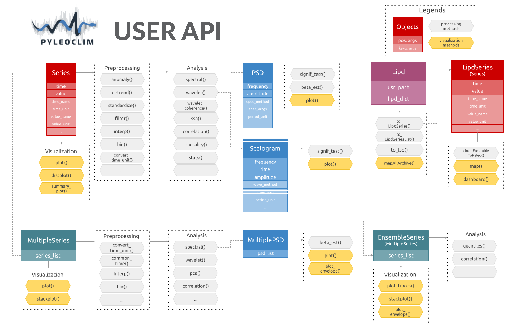

.. _core_api:

Pyleoclim User API
===================

Pyleoclim, like a lot of other Python packages, follows an object-oriented design. It sounds fancy, but it really is `quite simple <https://www.freecodecamp.org/news/object-oriented-programming-concepts-21bb035f7260/>`_. What this means for you is that we've gone through the trouble of coding up a lot of timeseries analysis methods that apply in various situations - so you don't have to worry about that.
These situations are described in classes, the beauty of which is called "inheritance" (see link above). Basically, it allows to define methods that will automatically apply to your dataset, as long as you put your data within one of those classes.
A major advantage of object-oriented design is that you, the user, can harness the power of Pyleoclim methods in very few lines of code through the user API without ever having to get your hands dirty with our code (unless you want to, of course).
The flipside is that any user would do well to understand Pyleoclim classes, what they are intended for, and what methods they support.

The following describes the various classes that undergird the Pyleoclim edifice.

Series (pyleoclim.Series)
"""""""""""""""""""""""""

.. automodule:: pyleoclim.core.series
   :members: Series

MultipleSeries (pyleoclim.MultipleSeries)
"""""""""""""""""""""""""""""""""""""""""

.. automodule:: pyleoclim.core.multipleseries
   :members: MultipleSeries

EnsembleSeries (pyleoclim.EnsembleSeries)
"""""""""""""""""""""""""""""""""""""""""

.. automodule:: pyleoclim.core.ensembleseries
   :members: EnsembleSeries

SurrogateSeries (pyleoclim.SurrogateSeries)
"""""""""""""""""""""""""""""""""""""""""""

.. automodule:: pyleoclim.core.surrogateseries
  :members: SurrogateSeries

Lipd (pyleoclim.Lipd)
"""""""""""""""""""""

This class allows to manipulate LiPD objects.

.. automodule:: pyleoclim.core.lipd
   :members: Lipd

LipdSeries (pyleoclim.LipdSeries)
"""""""""""""""""""""""""""""""""

.. automodule:: pyleoclim.core.lipdseries
   :members: LipdSeries

PSD (pyleoclim.PSD)
"""""""""""""""""""

.. automodule:: pyleoclim.core.psds
   :members: PSD

MultiplePSD (pyleoclim.MultiplePSD)
"""""""""""""""""""""""""""""""""""

 .. autoclass:: pyleoclim.core.psds.MultiplePSD
    :members:

Scalogram (pyleoclim.Scalogram)
"""""""""""""""""""""""""""""""

.. autoclass:: pyleoclim.core.scalograms.Scalogram
   :members:

MultipleScalogram (pyleoclim.MultipleScalogram)
"""""""""""""""""""""""""""""""""""""""""""""""
.. autoclass:: pyleoclim.core.scalograms.MultipleScalogram
   :members:

Coherence (pyleoclim.Coherence)
"""""""""""""""""""""""""""""""

.. automodule:: pyleoclim.core.coherence
   :members: Coherence

Corr (pyleoclim.Corr)
"""""""""""""""""""""

.. automodule:: pyleoclim.core.corr
   :members: Corr

CorrEns (pyleoclim.CorrEns)
"""""""""""""""""""""""""""

.. automodule:: pyleoclim.core.correns
   :members: CorrEns

SpatialDecomp (pyleoclim.SpatialDecomp)
"""""""""""""""""""""""""""""""""""""""

.. automodule:: pyleoclim.core.spatialdecomp
  :members: SpatialDecomp

SsaRes (pyleoclim.SsaRes)
"""""""""""""""""""""""""""

.. automodule:: pyleoclim.core.ssares
   :members: SsaRes
