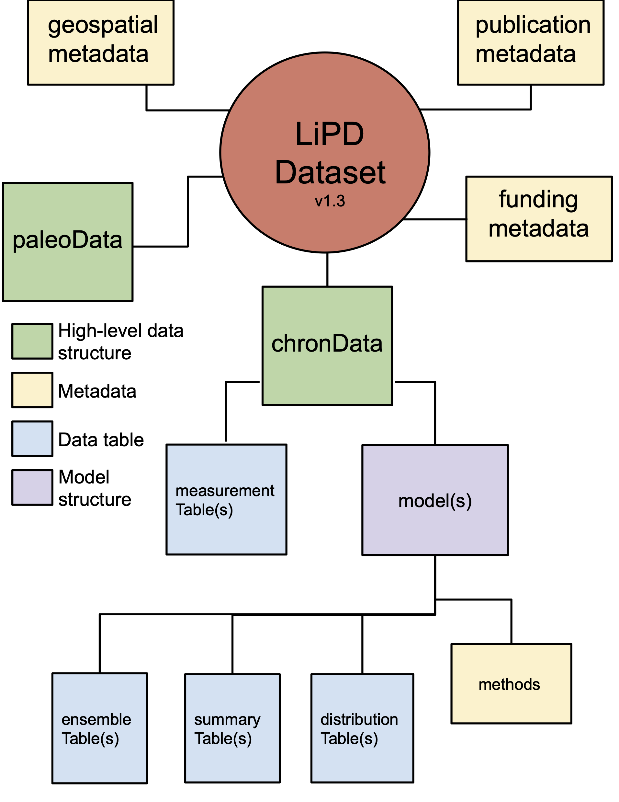

.. Pyleoclim documentation master file, created by
   sphinx-quickstart on Fri Feb 10 13:56:30 2017.
   You can adapt this file completely to your liking, but it should at least
   contain the root `toctree` directive.

.. toctree::
  :hidden:
   installation.rst
   citation.rst
   core/ui.rst
   utils/introduction.rst

Introduction
============

Pyleoclim is a Python package designed for the analysis of paleoclimate data.

Pyleoclim makes use of various data science libraries (numpy, pandas, scikit-learn) for time series analysis, as well as and Matplotlib and Cartopy for the creation of publication-quality figures.

The package is designed around object-oriented :ref:`Series <core_ui>`, which can be directly manipulated for plotting, spectral and wavelet analysis, and other time series-appropriate operations.
Pyleoclim natively "speaks" the language of Linked Paleo Data  (`LiPD <http://lipd.net>`_), which enables it to handle most of the data transformations internally, taking a good chunk of the pain out of analyzing paleoclimate data.
The package is aware of age ensembles stored via LiPD and uses them for time-uncertain analysis. Age ensembles can be generated through the `GeoChronR <http://nickmckay.github.io/GeoChronR/>`_ package, which natively stores them as ensemble tables in LiPD.

Getting Started
===============

The :ref:`installation guide <installation>` provides information on getting the package up and running. Basic familiarity with Python is essential, and many good tutorials exist on the topic.
The main Pyleoclim functions are available through its objected-oriented :ref:`interface <core_ui>`, and are documented at :ref:`<utils_introduction>'.
A basic introduction to plotting styles in Pyleoclim is provided in (`this notebook <https://nbviewer.jupyter.org/github/LinkedEarth/Pyleoclim_util/blob/master/example_notebooks/plot_styles.ipynb>`_).
More advanced paleogeoscientific workflows that leverage LiPD datasets are available as Jupyter notebooks through (`LiPDBooks <https://github.com/LinkedEarth/LiPDbooks>`_).

While convenient for the representation of paleoclimate observations, LiPD is not the only point of entry into Pyleoclim. The :ref:`Series <core_ui>` class is very flexible, and allows to apply Pyleoclim functionality to virtually any timeseries, including instrumental or model-generated data. Indeed, Pyleoclim is the workhorse supporting  (`more general machine-learning functionality <https://github.com/KnowledgeCaptureAndDiscovery/autoTS>`_) for all manner of timeseries.

Getting Involved
================

Pyleoclim was originally developed to allows scientists to analyze datasets in the LiPD format, including visualization, mapping, and time series analysis. Pyleoclim has been made freely available under the terms of the `GNU Public License <https://github.com/LinkedEarth/Pyleoclim_util/blob/master/license>`_.

There are many ways to get involved in the development of Pyleoclim:

  * If you write a paper making use of Pyleoclim, please consider :ref:`citing <citing_pyleoclim>`.
  * Report bugs and problems with the code or documentation to our `GitHub repository <https://github.com/LinkedEarth/Pyleoclim_util/issues>`_. Please make sure that there is not outstanding issues that cover the problem you're experiencing.
  * Contribute bug fixes
  * Contribute enhancements and new features

Search Pyleoclim
================

* :ref:`genindex`
* :ref:`modindex`
* :ref:`search`
