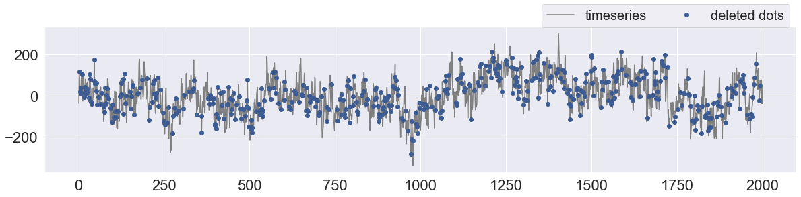
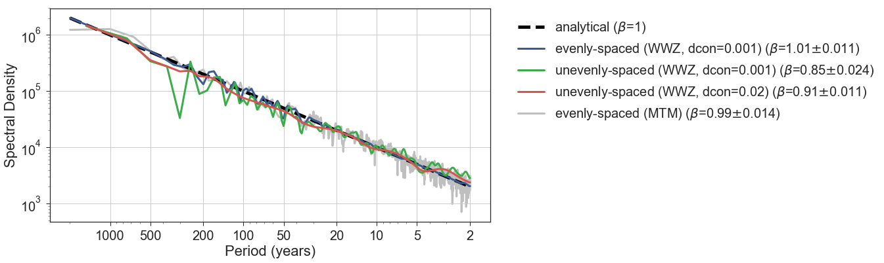
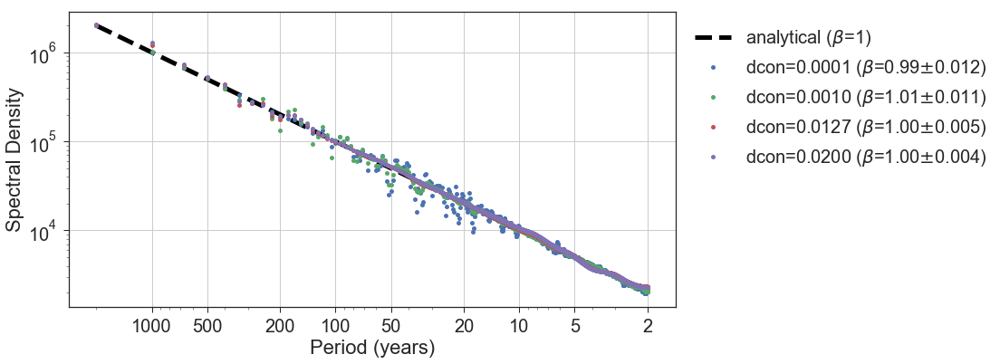
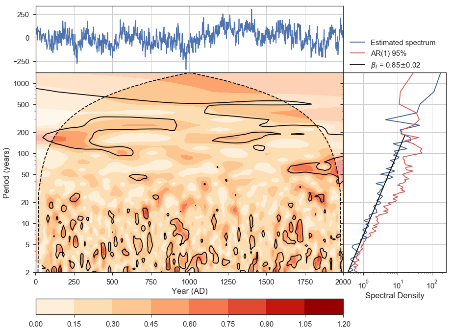

WWZ benchmark
=============

In this notebook, we will learn how to use the WWZ function of the
``pyleoclim`` package to do spectral anlaysis on a timeseries. In
detail, what we will do includes: + Generate an evenly-spaced colored
noise timeseries with a scaling exponent of 1 as an ideal test,
comparing WWZ and MTM + Delete 25% points of the timeseries randomly to
create a unevenly-spaced timeseries to test the performance of WWZ
handling nonuniform sampling + Benchmark the decaying constant in the
WWZ function + Wavelet analysis using WWZ

.. code:: ipython3

    import seaborn as sns
    import matplotlib.pyplot as plt
    
    import numpy as np
    from pyleoclim import Spectral

Generate evenly-spaced timeseries and delete some points
--------------------------------------------------------

Let’s first define a function to generate colored noise with a given
scaling exponent.

.. code:: ipython3

    def gen_noise(alpha, t, f0=None, m=None):
        ''' Generate a colored noise timeseries
    
        Args:
            alpha (float): exponent of the 1/f^alpha noise
            t (float): time vector of the generated noise
            f0 (float): fundamental frequency
            m (int): maximum number of the waves, which determines the highest frequency of the components in the synthetic noise
    
        Returns:
            y (array): the generated 1/f^alpha noise
    
        References:
            Eq. (15) in Kirchner, J. W. Aliasing in 1/f(alpha) noise spectra: origins, consequences, and remedies. Phys Rev E Stat Nonlin Soft Matter Phys 71, 066110 (2005).
        
        '''
        n = np.size(t)  # number of time points
        y = np.zeros(n)
    
        if f0 is None:
            f0 = 1/n  # fundamental frequency
        if m is None:
            m = n
    
        k = np.arange(m) + 1  # wave numbers
    
        theta = np.random.rand(int(m))*2*np.pi  # random phase
        for j in range(n):
            coeff = (k*f0)**(-alpha/2)
            sin_func = np.sin(2*np.pi*k*f0*t[j] + theta)
            y[j] = np.sum(coeff*sin_func)
    
        return y

Now let’s generate an evenly-spaced colored noise timeseries with the
scaling exponent of 1, and then delete 25% points randomly to create a
unevenly-spaced timeseries.

.. code:: ipython3

    np.random.seed(2333)
    
    to_evenly = np.arange(1, 2001)
    Xo_evenly = gen_noise(1, to_evenly, m=np.size(to_evenly)/2)  # set such m so that no aliasing occurs
    
    n_del = 500  # delete 500 pts from 2000 pts
    deleted_idx = np.random.choice(range(np.size(to_evenly)), n_del, replace=False)
    
    to_unevenly =  np.delete(to_evenly, deleted_idx)
    Xo_unevenly =  np.delete(Xo_evenly, deleted_idx)
    
    sns.set(style="darkgrid", font_scale=2)
    plt.subplots(figsize=[20, 4])
    plt.plot(to_evenly, Xo_evenly, color='gray', label='timeseries')
    plt.plot(to_evenly[deleted_idx], Xo_evenly[deleted_idx], 'o', color=sns.xkcd_rgb['denim blue'], label='deleted dots')
    plt.legend(fontsize=20, bbox_to_anchor=(1, 1.2), loc='upper right', ncol=3)

.. parsed-literal::

    <matplotlib.legend.Legend at 0x1c29470bd0>

.. code:: ipython3

    # show the location of the deleted points
    print(np.sort(deleted_idx))

.. parsed-literal::

    [   1    4    5    6    9   16   17   18   19   21   22   24   26   30
       32   33   36   37   45   46   47   51   52   54   57   62   66   72
       74   75   76   77   78   80   82   87   93   97   98  103  104  107
      109  115  120  124  125  129  130  133  135  137  150  152  154  157
      158  161  172  173  180  186  198  204  206  214  216  218  221  225
      226  231  233  238  247  248  252  258  261  273  275  279  283  284
      292  305  308  322  333  334  337  345  358  359  378  380  382  384
      386  392  394  397  398  401  402  406  407  413  417  422  424  434
      436  437  443  445  448  449  453  458  461  468  473  475  481  487
      490  491  493  496  497  504  505  506  507  519  525  527  530  533
      534  535  537  538  541  556  557  561  568  570  571  573  575  577
      583  591  600  601  603  614  618  622  631  635  644  653  654  656
      664  665  667  668  669  674  676  680  687  692  697  701  703  704
      709  718  724  725  730  739  755  757  763  768  769  772  777  778
      780  784  788  791  792  793  801  802  803  812  814  816  827  833
      837  840  844  860  865  867  868  869  875  876  877  878  883  887
      888  890  893  895  896  898  903  906  907  908  912  914  919  924
      926  927  931  932  933  944  947  955  962  971  973  974  978  985
      988  989  990  996  997 1004 1009 1012 1016 1018 1026 1033 1043 1044
     1049 1051 1052 1056 1059 1061 1069 1071 1072 1073 1077 1078 1081 1103
     1105 1107 1115 1116 1117 1119 1122 1126 1129 1140 1141 1143 1147 1156
     1167 1171 1173 1176 1177 1188 1190 1198 1202 1206 1208 1211 1212 1218
     1219 1223 1224 1225 1227 1229 1230 1232 1237 1250 1252 1265 1267 1269
     1272 1275 1276 1278 1280 1281 1284 1286 1287 1295 1301 1303 1308 1311
     1313 1323 1328 1330 1335 1337 1342 1344 1346 1347 1348 1360 1371 1373
     1377 1378 1379 1382 1388 1396 1398 1400 1409 1414 1417 1419 1420 1428
     1434 1435 1437 1438 1439 1446 1453 1455 1458 1459 1465 1467 1470 1476
     1480 1481 1484 1498 1499 1500 1501 1506 1508 1527 1529 1531 1533 1540
     1548 1549 1557 1558 1559 1563 1567 1569 1570 1571 1573 1574 1576 1586
     1588 1599 1611 1614 1617 1620 1627 1634 1640 1642 1644 1651 1655 1658
     1663 1667 1678 1680 1684 1685 1686 1688 1693 1694 1701 1705 1706 1710
     1714 1715 1721 1726 1742 1743 1752 1759 1763 1769 1771 1781 1784 1785
     1788 1792 1798 1801 1803 1804 1809 1810 1821 1823 1832 1833 1838 1840
     1841 1843 1844 1848 1850 1855 1866 1867 1870 1871 1878 1879 1892 1896
     1898 1903 1907 1909 1913 1920 1921 1932 1935 1939 1942 1943 1945 1946
     1955 1963 1967 1968 1971 1975 1977 1981 1990 1991]

Compare PSDs of evenly/unevenly-spaced timeseries
-------------------------------------------------

Now we will use the function ``Spectral.wwz_psd()`` to do spectral
analysis on the evenly/unevenly-spaced timeseries using WWZ method. Also
we will calculate the analytical PSD, as well as the PSD calculated with
MTM for comparison.

.. code:: ipython3

    %%time
    
    freqs = None
    tau_evenly = np.linspace(np.min(to_evenly), np.max(to_evenly), 101)
    tau_unevenly = np.linspace(np.min(to_unevenly), np.max(to_unevenly), 101)
    dcon = 1e-3
    
    res_psd_evenly = Spectral.wwz_psd(Xo_evenly, to_evenly, freqs=freqs, tau=tau_evenly, c=dcon, standardize=False, nMC=0, anti_alias=False)
    res_psd_unevenly = Spectral.wwz_psd(Xo_unevenly, to_unevenly, freqs=freqs, tau=tau_unevenly, c=dcon, standardize=False, nMC=0, anti_alias=False)
    res_psd_unevenly_high_dcon = Spectral.wwz_psd(Xo_unevenly, to_unevenly, freqs=freqs, tau=tau_unevenly, c=0.02, standardize=False, nMC=0, anti_alias=False)

.. parsed-literal::

    CPU times: user 44 s, sys: 122 ms, total: 44.1 s
    Wall time: 5.78 s

.. code:: ipython3

    # analytical PSD
    psd_ideal_ref = 0.5*res_psd_evenly.freqs**(-1)/(1/np.size(to_evenly))

.. parsed-literal::

    /Users/fzhu/.pyenv/versions/anaconda3-5.0.1/envs/py3.6/lib/python3.6/site-packages/ipykernel_launcher.py:2: RuntimeWarning: divide by zero encountered in reciprocal
      

.. code:: ipython3

    # PSD calculated with MTM for comparison
    import nitime.algorithms as tsa
    freq_mtm, psd_mtm, nu = tsa.multi_taper_psd(Xo_evenly, adaptive=False, jackknife=False, NW=2, Fs=1)

.. parsed-literal::

    /Users/fzhu/.pyenv/versions/anaconda3-5.0.1/envs/py3.6/lib/python3.6/site-packages/nitime/utils.py:980: FutureWarning: Conversion of the second argument of issubdtype from `complex` to `np.complexfloating` is deprecated. In future, it will be treated as `np.complex128 == np.dtype(complex).type`.
      complex_result = (np.issubdtype(in1.dtype, np.complex) or
    /Users/fzhu/.pyenv/versions/anaconda3-5.0.1/envs/py3.6/lib/python3.6/site-packages/nitime/utils.py:981: FutureWarning: Conversion of the second argument of issubdtype from `complex` to `np.complexfloating` is deprecated. In future, it will be treated as `np.complex128 == np.dtype(complex).type`.
      np.issubdtype(in2.dtype, np.complex))

We can use the function ``Spectral.beta_estimation()`` to estimate the
scaling exponent of a PSD curve within a frequency range as below.

.. code:: ipython3

    freq_range = [1/200, 1/2]  # range for beta estimation
    
    res_beta_evenly = Spectral.beta_estimation(
        res_psd_evenly.psd, res_psd_evenly.freqs, freq_range[0], freq_range[1]
    )
    
    res_beta_unevenly = Spectral.beta_estimation(
        res_psd_unevenly.psd, res_psd_unevenly.freqs, freq_range[0], freq_range[1]
    )
    
    res_beta_unevenly_high_dcon = Spectral.beta_estimation(
        res_psd_unevenly_high_dcon.psd, res_psd_unevenly_high_dcon.freqs, freq_range[0], freq_range[1]
    )
    
    res_beta_mtm = Spectral.beta_estimation(
        psd_mtm, freq_mtm, freq_range[0], freq_range[1]
    )

Now let’s plot and compare the PSD curves.

.. code:: ipython3

    period_ticks = [2, 5, 10, 20, 50, 100, 200, 500, 1000]
    
    fig = Spectral.plot_psd(psd_ideal_ref, res_psd_evenly.freqs, plot_ar1=False, psd_ar1_q95=None, period_ticks=period_ticks, lmstyle='--', color='k', label=r'analytical ($\beta$=1)'.format(res_beta_evenly.beta), figsize=[12, 6], linewidth=5)
    plt.plot(1/res_psd_evenly.freqs, res_psd_evenly.psd, '-', linewidth=3, label=r'evenly-spaced (WWZ, dcon=0.001) ($\beta$={:.2f}$\pm${:.3f})'.format(res_beta_evenly.beta, res_beta_evenly.std_err), color=sns.xkcd_rgb['denim blue'])
    plt.plot(1/res_psd_unevenly.freqs, res_psd_unevenly.psd, '-', linewidth=3, label=r'unevenly-spaced (WWZ, dcon=0.001) ($\beta$={:.2f}$\pm${:.3f})'.format(res_beta_unevenly.beta, res_beta_unevenly.std_err), color=sns.xkcd_rgb['medium green'])
    plt.plot(1/res_psd_unevenly_high_dcon.freqs, res_psd_unevenly_high_dcon.psd, '-', linewidth=3, label=r'unevenly-spaced (WWZ, dcon=0.02) ($\beta$={:.2f}$\pm${:.3f})'.format(res_beta_unevenly_high_dcon.beta, res_beta_unevenly_high_dcon.std_err), color=sns.xkcd_rgb['pale red'])
    plt.plot(1/freq_mtm, psd_mtm, '-', linewidth=3, label=r'evenly-spaced (MTM) ($\beta$={:.2f}$\pm${:.3f})'.format(res_beta_mtm.beta, res_beta_mtm.std_err), color='gray', alpha=0.5, zorder=-1)
    
    # plt.plot(1/res_beta_evenly.f_binned, res_beta_evenly.Y_reg, '--', color='k', linewidth=3, zorder=99)
    # plt.plot(1/res_beta_unevenly.f_binned, res_beta_unevenly.Y_reg, '--', color='k', linewidth=3, zorder=99)
    # plt.plot(1/res_beta_mtm.f_binned, res_beta_mtm.Y_reg, '--', color='k', linewidth=3, zorder=99)
    
    plt.legend(fontsize=20, bbox_to_anchor=(1.9, 1), loc='upper right', ncol=1)

.. parsed-literal::

    /Users/fzhu/.pyenv/versions/anaconda3-5.0.1/envs/py3.6/lib/python3.6/site-packages/pyleoclim-0.4.8-py3.6.egg/pyleoclim/Spectral.py:2574: RuntimeWarning: divide by zero encountered in true_divide
      x_data = 1 / freqs
    /Users/fzhu/.pyenv/versions/anaconda3-5.0.1/envs/py3.6/lib/python3.6/site-packages/pyleoclim-0.4.8-py3.6.egg/pyleoclim/Spectral.py:2576: RuntimeWarning: divide by zero encountered in true_divide
      x_data_ar1 = 1 / freqs
    /Users/fzhu/.pyenv/versions/anaconda3-5.0.1/envs/py3.6/lib/python3.6/site-packages/ipykernel_launcher.py:5: RuntimeWarning: divide by zero encountered in true_divide
      """
    /Users/fzhu/.pyenv/versions/anaconda3-5.0.1/envs/py3.6/lib/python3.6/site-packages/ipykernel_launcher.py:6: RuntimeWarning: divide by zero encountered in true_divide
      
    /Users/fzhu/.pyenv/versions/anaconda3-5.0.1/envs/py3.6/lib/python3.6/site-packages/ipykernel_launcher.py:7: RuntimeWarning: divide by zero encountered in true_divide
      import sys
    /Users/fzhu/.pyenv/versions/anaconda3-5.0.1/envs/py3.6/lib/python3.6/site-packages/ipykernel_launcher.py:8: RuntimeWarning: divide by zero encountered in true_divide
      

.. parsed-literal::

    <matplotlib.legend.Legend at 0x1a0f4ace48>

The figure above indicates that in the case of an evenly-spaced
timeseries, both WWZ and MTM give good estimates of the analytical PSD.
WWZ gives almost accurate PSD over the high frequency band (2-20 yrs),
while MTM gives big oscillations there.

When we delete 25% of the data, making the timeseries unevenly-spaced,
WWZ with a small decaying constant gives lower estimate of the scaling
exponent due to aliasing caused by nonuniform sampling, and a larger
decaying constant helps a bit.

Benchmark the decaying constant
-------------------------------

The decaying constant will affect the frequency resolution of the WWZ
method. Larger constant results in smoother PSD curve, as shown below.

.. code:: ipython3

    freqs = None
    tau_evenly = np.linspace(np.min(to_evenly), np.max(to_evenly), 101)
    res_psd = {}
    res_beta = {}
    freq_range = [1/200, 1/2]  # range for beta estimation
    
    # dcon options:
    # + 1/(8*np.pi**2) from Witt & Schumann 2005
    # + 0.0125 from Foster 1996, very close to 1/(8*np.pi**2)
    # + 0.001 from Kirchner & Neal 2013
    fig = Spectral.plot_psd(psd_ideal_ref, res_psd_evenly.freqs, plot_ar1=False, psd_ar1_q95=None, period_ticks=period_ticks,
                            lmstyle='--', color='k', label=r'analytical ($\beta$=1)'.format(res_beta_evenly.beta), figsize=[12, 6], linewidth=5)
    for dcon in [0.0001, 0.001, 1/(8*np.pi**2), 0.02]:
        res_psd[str(dcon)] = Spectral.wwz_psd(Xo_evenly, to_evenly, freqs=freqs, tau=tau_evenly, c=dcon, standardize=False, nMC=0, anti_alias=False)
        res_beta[str(dcon)] = Spectral.beta_estimation(
                              res_psd[str(dcon)].psd, res_psd[str(dcon)].freqs, freq_range[0], freq_range[1]
                          )
        plt.plot(1/res_psd[str(dcon)].freqs, res_psd[str(dcon)].psd, 'o', ms=5, linewidth=3, label='dcon={:.4f} '.format(dcon)+r'($\beta$={:.2f}$\pm${:.3f})'.format(res_beta[str(dcon)].beta, res_beta[str(dcon)].std_err))
                     
    plt.legend(fontsize=20, bbox_to_anchor=(1.54, 1), loc='upper right', ncol=1)

.. parsed-literal::

    /Users/fzhu/.pyenv/versions/anaconda3-5.0.1/envs/py3.6/lib/python3.6/site-packages/pyleoclim-0.4.8-py3.6.egg/pyleoclim/Spectral.py:2574: RuntimeWarning: divide by zero encountered in true_divide
      x_data = 1 / freqs
    /Users/fzhu/.pyenv/versions/anaconda3-5.0.1/envs/py3.6/lib/python3.6/site-packages/pyleoclim-0.4.8-py3.6.egg/pyleoclim/Spectral.py:2576: RuntimeWarning: divide by zero encountered in true_divide
      x_data_ar1 = 1 / freqs
    /Users/fzhu/.pyenv/versions/anaconda3-5.0.1/envs/py3.6/lib/python3.6/site-packages/ipykernel_launcher.py:18: RuntimeWarning: divide by zero encountered in true_divide

.. parsed-literal::

    <matplotlib.legend.Legend at 0x1c26b1de10>

Wavelet analysis
----------------

Now let’s do some wavelet analysis on both the evenly/unevenly-spaced
data. Note that ``nMC`` sets the number of Monte-Carlo simulations for
significance test.

.. code:: ipython3

    # evenly-spaced timeseries
    freqs = None
    tau_evenly = np.linspace(np.min(to_evenly), np.max(to_evenly), 101)
    freq_range = [1/200, 1/2]
    period_ticks = [2, 5, 10, 20, 50, 100, 200, 500, 1000]
    fig = Spectral.plot_summary(Xo_evenly, to_evenly, nMC=5, ts_style='-', tau=tau_evenly, period_ticks=period_ticks, period_S=freq_range, period_L=None)

.. parsed-literal::

    /Users/fzhu/.pyenv/versions/anaconda3-5.0.1/envs/py3.6/lib/python3.6/site-packages/matplotlib/cbook/deprecation.py:107: MatplotlibDeprecationWarning: Passing one of 'on', 'true', 'off', 'false' as a boolean is deprecated; use an actual boolean (True/False) instead.
      warnings.warn(message, mplDeprecation, stacklevel=1)
    /Users/fzhu/.pyenv/versions/anaconda3-5.0.1/envs/py3.6/lib/python3.6/site-packages/matplotlib/cbook/deprecation.py:107: MatplotlibDeprecationWarning: Passing one of 'on', 'true', 'off', 'false' as a boolean is deprecated; use an actual boolean (True/False) instead.
      warnings.warn(message, mplDeprecation, stacklevel=1)
    /Users/fzhu/.pyenv/versions/anaconda3-5.0.1/envs/py3.6/lib/python3.6/site-packages/matplotlib/cbook/deprecation.py:107: MatplotlibDeprecationWarning: Passing one of 'on', 'true', 'off', 'false' as a boolean is deprecated; use an actual boolean (True/False) instead.
      warnings.warn(message, mplDeprecation, stacklevel=1)
    Monte-Carlo simulations: 100%|██████████| 5/5 [00:08<00:00,  1.64s/it]
    /Users/fzhu/.pyenv/versions/anaconda3-5.0.1/envs/py3.6/lib/python3.6/site-packages/pyleoclim-0.4.8-py3.6.egg/pyleoclim/Spectral.py:2327: RuntimeWarning: divide by zero encountered in true_divide
      plt.contourf(tau, 1/freqs, wwa.T, cmap=clr_map, origin=origin)
    /Users/fzhu/.pyenv/versions/anaconda3-5.0.1/envs/py3.6/lib/python3.6/site-packages/pyleoclim-0.4.8-py3.6.egg/pyleoclim/Spectral.py:2373: RuntimeWarning: divide by zero encountered in true_divide
      plt.contour(tau, 1/freqs, signif.T, [-99, 1], colors='k')
    Monte-Carlo simulations: 100%|██████████| 5/5 [00:08<00:00,  1.78s/it]
    /Users/fzhu/.pyenv/versions/anaconda3-5.0.1/envs/py3.6/lib/python3.6/site-packages/pyleoclim-0.4.8-py3.6.egg/pyleoclim/Spectral.py:2570: RuntimeWarning: divide by zero encountered in true_divide
      y_data = 1 / freqs
    /Users/fzhu/.pyenv/versions/anaconda3-5.0.1/envs/py3.6/lib/python3.6/site-packages/pyleoclim-0.4.8-py3.6.egg/pyleoclim/Spectral.py:2572: RuntimeWarning: divide by zero encountered in true_divide
      y_data_ar1 = 1 / freqs
    /Users/fzhu/.pyenv/versions/anaconda3-5.0.1/envs/py3.6/lib/python3.6/site-packages/matplotlib/cbook/deprecation.py:107: MatplotlibDeprecationWarning: Passing one of 'on', 'true', 'off', 'false' as a boolean is deprecated; use an actual boolean (True/False) instead.
      warnings.warn(message, mplDeprecation, stacklevel=1)

.. image:: WWZ_benchmark_files/WWZ_benchmark_23_1.png

.. code:: ipython3

    # unevenly-spaced timeseries
    freqs = None
    tau_unevenly = np.linspace(np.min(to_unevenly), np.max(to_unevenly), 101)
    freq_range = [1/200, 1/2]
    period_ticks = [2, 5, 10, 20, 50, 100, 200, 500, 1000]
    fig = Spectral.plot_summary(Xo_unevenly, to_unevenly, nMC=5, ts_style='-', tau=tau_unevenly, period_ticks=period_ticks, period_S=freq_range, period_L=None)

.. parsed-literal::

    /Users/fzhu/.pyenv/versions/anaconda3-5.0.1/envs/py3.6/lib/python3.6/site-packages/matplotlib/cbook/deprecation.py:107: MatplotlibDeprecationWarning: Passing one of 'on', 'true', 'off', 'false' as a boolean is deprecated; use an actual boolean (True/False) instead.
      warnings.warn(message, mplDeprecation, stacklevel=1)
    /Users/fzhu/.pyenv/versions/anaconda3-5.0.1/envs/py3.6/lib/python3.6/site-packages/matplotlib/cbook/deprecation.py:107: MatplotlibDeprecationWarning: Passing one of 'on', 'true', 'off', 'false' as a boolean is deprecated; use an actual boolean (True/False) instead.
      warnings.warn(message, mplDeprecation, stacklevel=1)
    /Users/fzhu/.pyenv/versions/anaconda3-5.0.1/envs/py3.6/lib/python3.6/site-packages/matplotlib/cbook/deprecation.py:107: MatplotlibDeprecationWarning: Passing one of 'on', 'true', 'off', 'false' as a boolean is deprecated; use an actual boolean (True/False) instead.
      warnings.warn(message, mplDeprecation, stacklevel=1)
    Monte-Carlo simulations: 100%|██████████| 5/5 [00:04<00:00,  1.02it/s]
    /Users/fzhu/.pyenv/versions/anaconda3-5.0.1/envs/py3.6/lib/python3.6/site-packages/pyleoclim-0.4.8-py3.6.egg/pyleoclim/Spectral.py:2327: RuntimeWarning: divide by zero encountered in true_divide
      plt.contourf(tau, 1/freqs, wwa.T, cmap=clr_map, origin=origin)
    /Users/fzhu/.pyenv/versions/anaconda3-5.0.1/envs/py3.6/lib/python3.6/site-packages/pyleoclim-0.4.8-py3.6.egg/pyleoclim/Spectral.py:2373: RuntimeWarning: divide by zero encountered in true_divide
      plt.contour(tau, 1/freqs, signif.T, [-99, 1], colors='k')
    Monte-Carlo simulations: 100%|██████████| 5/5 [00:05<00:00,  1.00s/it]
    /Users/fzhu/.pyenv/versions/anaconda3-5.0.1/envs/py3.6/lib/python3.6/site-packages/pyleoclim-0.4.8-py3.6.egg/pyleoclim/Spectral.py:2570: RuntimeWarning: divide by zero encountered in true_divide
      y_data = 1 / freqs
    /Users/fzhu/.pyenv/versions/anaconda3-5.0.1/envs/py3.6/lib/python3.6/site-packages/pyleoclim-0.4.8-py3.6.egg/pyleoclim/Spectral.py:2572: RuntimeWarning: divide by zero encountered in true_divide
      y_data_ar1 = 1 / freqs
    /Users/fzhu/.pyenv/versions/anaconda3-5.0.1/envs/py3.6/lib/python3.6/site-packages/matplotlib/cbook/deprecation.py:107: MatplotlibDeprecationWarning: Passing one of 'on', 'true', 'off', 'false' as a boolean is deprecated; use an actual boolean (True/False) instead.
      warnings.warn(message, mplDeprecation, stacklevel=1)

